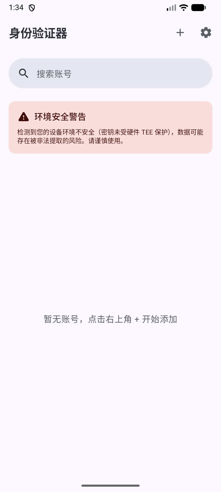
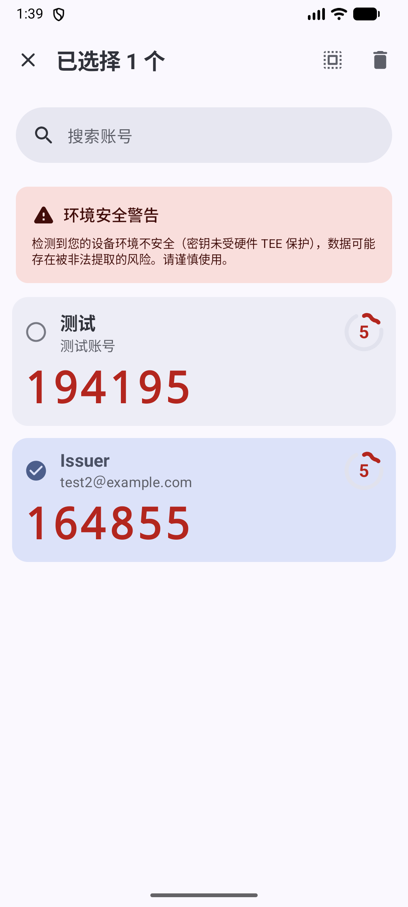
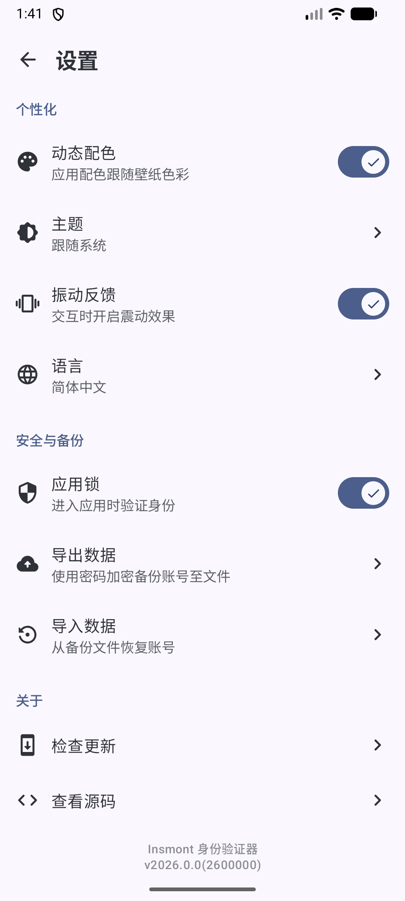

# Authenticator

Authenticator 是一款现代、简洁且注重隐私的 Android 双重身份验证 (2FA) 应用程序。

## 主要功能

- **多算法支持**：支持 TOTP (时间令牌) 和 HOTP (计数令牌)。
- **安全保障**：
    - **生物识别锁定**：支持指纹、面部识别或设备凭据解锁应用。
    - **防截屏保护**：自动禁用系统截屏和录屏功能，防止验证码泄露。
    - **加密存储**：使用 Android Keystore 和 AES 加密技术安全存储您的私钥。
- **备份与恢复**：提供加密的备份功能，确保在更换设备时可以安全地恢复账户。
- **隐私优先**：应用完全离线运行，不收集任何用户数据。
- **便捷操作**：
    - 支持扫描二维码快速添加账户。
    - **搜索功能**：通过发行者或账户名称快速查找。
    - **批量管理**：支持多选模式，方便进行批量删除或编辑。

## 屏幕截图

<p align="center">
  
  
  
</p>

## 如何开始

### 构建与安装
1. 克隆此仓库：
   ```bash
   git clone https://github.com/Insmont/authenticator.git
   ```
2. 在 Android Studio 中打开项目。
3. 同步 Gradle 并运行项目。